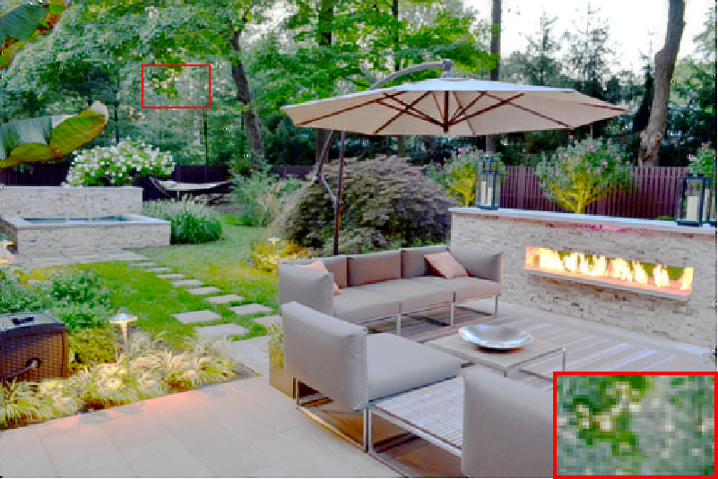
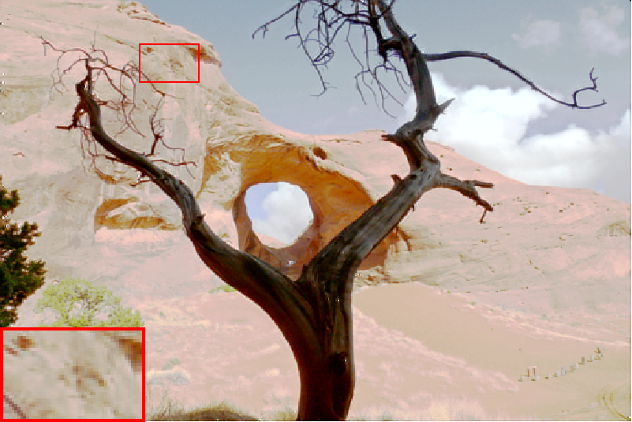

# LightFuse: Lightweight CNN based Dual-exposure Fusion
##
<p align="middle">
  
  
  
  
  
  
  
  
  
  &emsp;&emsp;&emsp;&emsp; DeepFuse&emsp;&emsp;&emsp;&emsp;&emsp;&emsp;&emsp;&emsp;&emsp; Mertens09&emsp;&emsp;&emsp;&emsp;&emsp;&emsp;&emsp;&emsp; &emsp; Proposed&emsp;&emsp;&emsp;&emsp;&emsp;&emsp;&emsp;&emsp;&emsp; Reference
</p>

This is the implementation for [LightFuse: Lightweight CNN based Dual-exposure Fusion]().

To our best knowledge, this is the first lightweight HDR fusion algorithm that could be used in power and resource constrained edge-computing devices. It is challenging to train a lightweight model with fewer parameters and layers while maintain comparable performance. The proposed LightFuse model consists of two sub-networks: a ```CombiningNet``` and a ```FilteringNet```. The ```goal of CombiningNet is to learn the channel-related information, whereas FilteringNet aims in combining the spatial information```. Both CombiningNet and FilteringNet is based on ```depthwise separable convolution``` to reduce required parameters and computations. LightFuse is trained with extreme exposure images to avoid possible fail during inference phase.

## Get Started
### Prerequisites
 * Python 	       = 3.7.9
 * TensorFlow     = 1.15.0
 * Opencv-python  = 4.4.0.44
 * Scipy          = 1.5.2
 * Matplotlib     = 3.3.1
  
### Setup
 * Clone this repo:
 ```
 git clone https://github.com/Taichi-Pink/LightFuse-Lightweight-CNN-based-Dual-exposure-Fusion.git
 cd LightFuse-Lightweight-CNN-based-Dual-exposure-Fusion
 ```
 <!-- * Download data from [SICE dataset](https://github.com/csjcai/SICE). Place it under ```Dataset``` folder. Split the data in Dataset_Part1 into train (80%) and test (20%) set. -->

### Demo
 ```
 python test.py
 ```
### Train
  * Prepare TFRecord.
  ```
  python FuDataset.py
  ```
  * run train.py


<!-- ## Citation --> 
